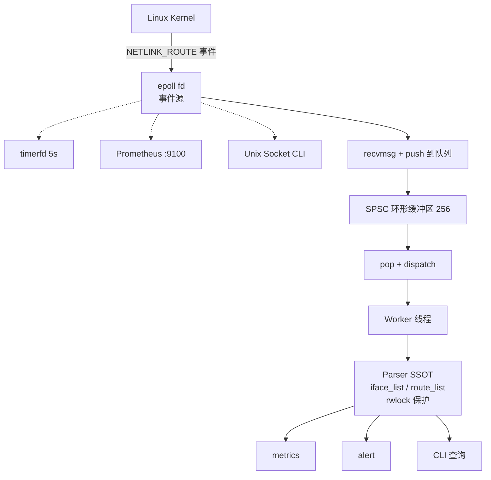
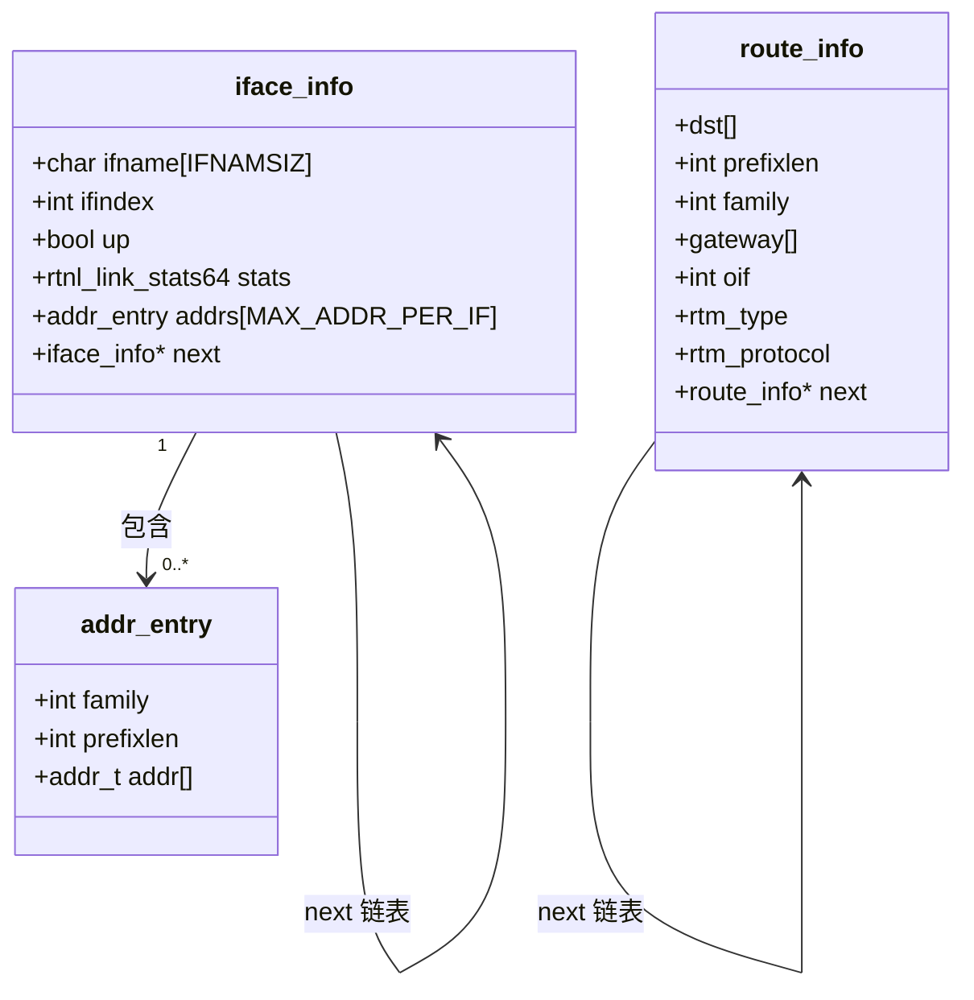
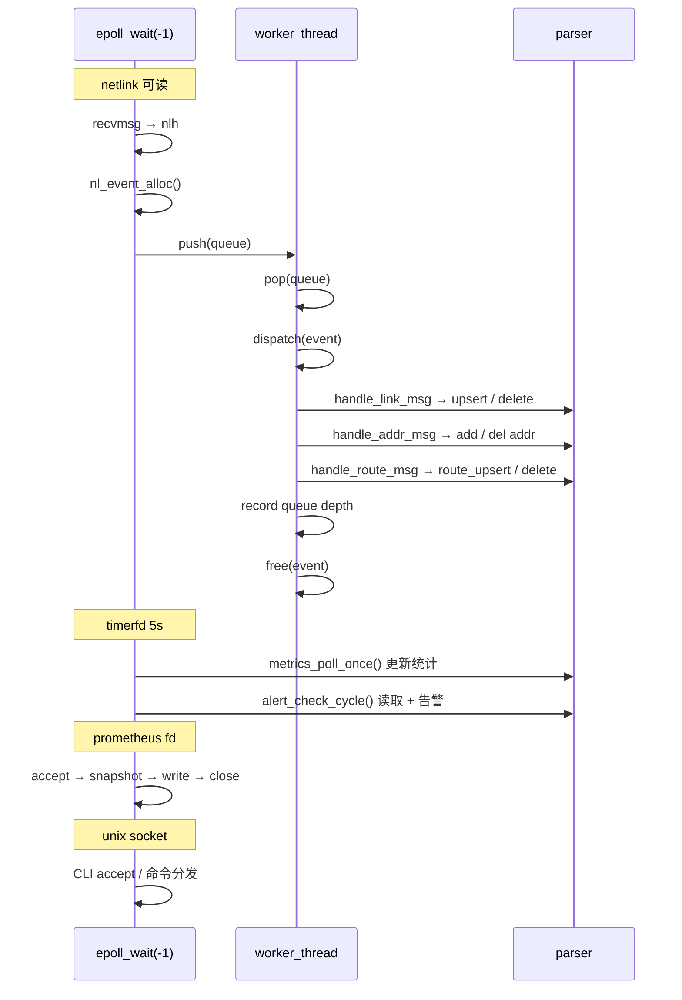

# Netlink-Agent

`Netlink-Agent` 是一个基于 `Netlink + epoll` 的 Linux 网络监控守护进程。
它订阅内核 `NETLINK_ROUTE` 事件，维护用户态网络状态模型（接口、地址、路由），
并通过 Unix Domain Socket CLI 和 Prometheus `/metrics` 端点暴露可观测性。

## 核心能力

- **事件驱动守护进程** — `epoll_wait(-1)`，timerfd、netlink、prometheus、unix socket 统一为 fd 事件源。
- **内核事件订阅** — 监听 link、IPv4/IPv6 address、IPv4/IPv6 route 事件。
- **SPSC 工作队列** — 无锁环形缓冲区解耦 Netlink 接收与状态更新，带 backpressure 丢弃统计。
- **用户态状态模型（SSOT）** — 接口状态、完整 `rtnl_link_stats64` 计数器、地址列表、路由表。
- **Prometheus 导出** — HTTP `/metrics` on `:9100`，标准格式带 HELP/TYPE 注解。
- **原子配置热加载** — 双缓冲 `config_t`，`SIGHUP` 或 CLI `reload` 触发，环境变量覆盖。
- **Perf 基准测试** — 自动化 `perf stat` 吞吐量分析，三级强度。
- **ASan + UBSan 构建目标** — `make asan` 在开发阶段捕获未对齐访问、泄漏和未定义行为。

## 架构



### 数据模型



### 时序图



## 目录结构

```text
Netlink-Agent/
├── benchmark/
│   ├── perf_report.md         # 最新 perf 基准报告
│   └── stress_log.md          # 性能基线
├── tests/
│   ├── stress_test.sh         # 参数化压力测试 (veth / addr / CLI)
│   └── perf_bench.sh          # 三级 perf stat 基准测试
├── src/
│   ├── main.c                 # 入口、初始化、epoll 循环、信号处理
│   ├── netlink.c/.h           # netlink socket、事件解析、dispatch
│   ├── parser.c/.h            # SSOT 状态模型 (接口 + 地址 + 路由)
│   ├── event_queue.c/.h       # SPSC 无锁环形缓冲区
│   ├── event_worker.c/.h      # 工作线程 (pop → dispatch → free)
│   ├── metrics.c/.h           # 周期性统计刷新触发器
│   ├── alert.c/.h             # 错误/流量阈值检测
│   ├── cli.c/.h               # Unix Domain Socket CLI
│   ├── prom.c/.h              # Prometheus HTTP 导出 (:9100)
│   ├── config.c/.h            # 原子双缓冲配置 (SIGHUP 热加载)
│   ├── runtime_metrics.c/.h   # 事件/深度/丢弃/worker 计数器
│   └── logger.c/.h            # 带时间戳的 stdout 日志
├── conf/
│   └── nlagent.conf           # 示例配置
├── systemd/
│   └── nlagent.service        # systemd 单元模板
├── Makefile
└── LICENSE
```

## 快速开始

### 构建

```bash
make          # 发行版 (-O2)
make debug    # 调试版 (-O0 -DDEBUG)
make asan     # AddressSanitizer + UBSan
```

### 运行

```bash
sudo ./build/nlagent
```

或：

```bash
make run
```

### 使用 CLI 查询

```bash
nc -U /tmp/nlagent.sock
```

可用命令：

| 命令                       | 说明                                |
|---|-------------------------------------|
| `show interfaces`, `list`  | 所有接口状态、统计计数器和地址         |
| `show interface <ifname>`  | 单个接口详情                         |
| `show routes`              | 路由表 (目的网络、协议、网关、出接口)  |
| `show metrics`             | 运行时计数器和队列深度                |
| `reload`                   | 从环境变量热加载配置                  |
| `help`                     | 显示帮助                             |
| `quit`, `exit`             | 关闭连接                             |

示例 — 路由表：

```bash
$ nc -U /tmp/nlagent.sock
> show routes
=== Route Table (13 entries) ===
Destination          Proto   Gateway          OIF
ff00::/8             kernel  *                eth0
fe80::/64            kernel  *                eth0
::1/128              kernel  *                lo
192.168.16.0/20      kernel  *                eth0
0.0.0.0/0            dhcp    192.168.16.1     eth0
...
```

示例 — 运行时指标：

```bash
> show metrics
=== Runtime Metrics ===
netlink_events_total 4048
  link_events 1508
  addr_events 141
  route_events 2399
netlink_dropped_total 487
worker_events_total 4048
queue_depth_current 0
queue_depth_max 255
backpressure_pct 12.0%
...
```

### Prometheus

```bash
curl http://localhost:9100/metrics
```

### 配置热加载

```bash
# 通过 CLI
echo reload | nc -U /tmp/nlagent.sock

# 通过信号
sudo kill -HUP $(pgrep nlagent)

# 重载时覆盖阈值
NLAGENT_ERR_THRESHOLD=5 NLAGENT_TRAFFIC_MBPS=20 systemctl reload nlagent
```

### 压力测试

```bash
# 交互式压测 (15s, 200 veth, 50 addr, 30 CLI 并发)
sudo bash tests/stress_test.sh -d 15 -v 200 -a 50 -c 30

# Perf 基准 (三级自动化分析)
sudo bash tests/stress_test.sh -p
```

## 技术亮点

- **纯事件驱动 epoll** — `epoll_wait(-1)` 阻塞直到真实 fd 事件到达。零轮询，零超时 hack，所有 I/O 和定时器都是 fd。
- **SPSC 无锁队列** — 环形缓冲区解耦 `recvmsg` 与 handler 分发。256 槽位，原子 head/tail，backpressure 丢弃统计可在 metrics 中可见。
- **统一状态模型（SSOT）** — `parser.c` 在 `pthread_rwlock_t` 下持有接口和路由状态，所有其他模块通过 parser API 读取。
- **原子配置热加载** — 双缓冲 `config_t` 通过 `_Atomic(config_t *)` 原子交换。零停机重载，告警和分发路径中的并发读取安全。
- **内建可观测性** — Prometheus 端点、运行时指标、结构化日志（INFO/WARN/ERROR）、自动化 `perf stat` 分析。
- **Sanitizer CI 就绪** — `make asan` 编译带 AddressSanitizer + UBSan。已通过 valgrind 零泄漏启动-关闭循环验证。

## 当前边界

- 配置从环境变量读取；基于文件的配置解析器尚未实现。
- 路由表在高频变更场景下无限增长（无 LRU 淘汰）。
- 告警阈值仅被动触发；无 hysteresis 或 rate-limiting。
- ARM 对齐安全依赖 netlink 统计路径中的 `memcpy`（UBSan 已验证通过）。

## 路线图

1. 文件配置作为主源，环境变量作为覆盖 (`/etc/nlagent.conf`)。
2. 高频场景下的路由表 LRU 淘汰。
3. 告警去重与 hysteresis。
4. CLI `json` 输出模式。
5. `make install` 与 systemd 单元路径对齐。
6. CI 工作流 (build + asan + stress + valgrind)。

## 许可证

MIT License。详见 `LICENSE`。
